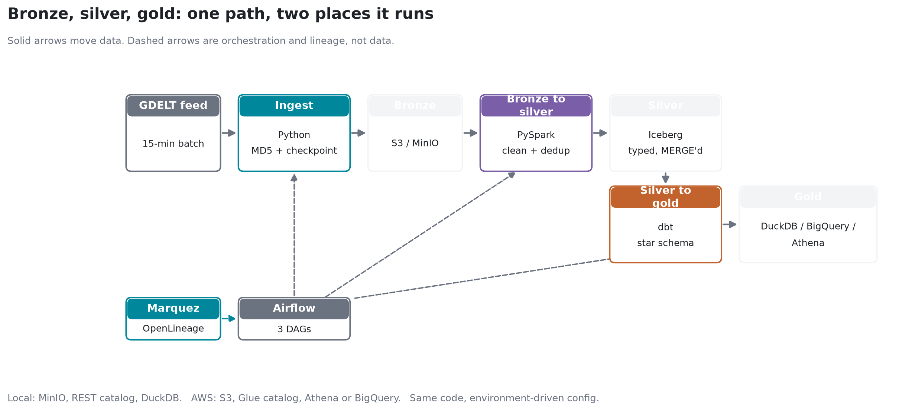
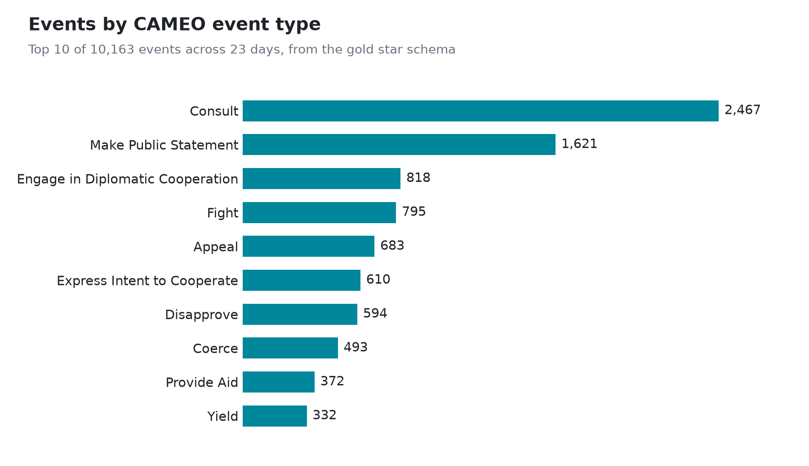
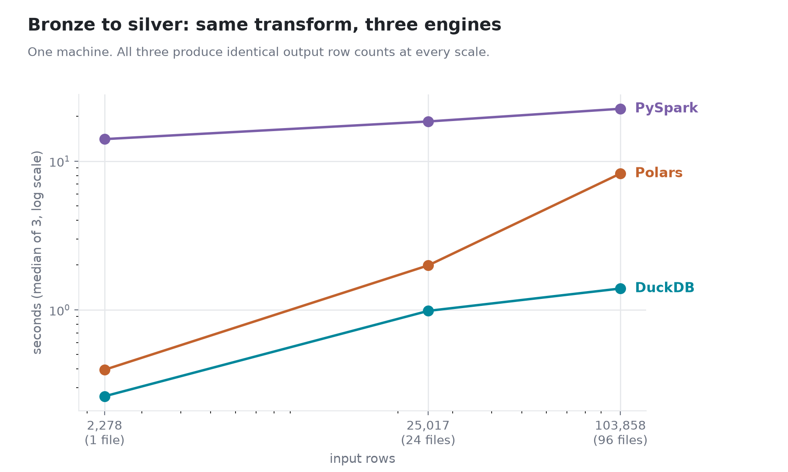

# GDELT Global Events Lakehouse

[](https://github.com/abhirammv2000/gdelt-lakehouse/actions/workflows/ci.yml)

An end-to-end lakehouse for the GDELT 2.0 global events feed, built with the patterns
you would use in production and run locally on Docker. GDELT publishes a new batch of
world-news events every 15 minutes as tab-delimited files with no header, 61 columns,
and the usual real-world mess (nulls, encoding quirks, the occasional malformed row).
This project ingests that feed, cleans and models it, and serves a tested star schema.

The same code runs against the local stack or against cloud services. What changes is
configuration (endpoints, credentials, catalog type) read from the environment, not
the code.

## Architecture

A bronze / silver / gold medallion layout:

- Ingestion (Python): poll the feed, verify the MD5 checksum, land the raw zips in
  the bronze bucket, and checkpoint so re-runs are safe.
- Bronze to silver (PySpark): parse the 61 columns, cast and clean, drop
  duplicates, and MERGE into the silver table. Rows that do not match the
  61-field contract go to a rejects table instead of being forced into the data.
  The table format follows the catalog: Iceberg on the Glue and REST catalogs,
  Delta on Unity Catalog. The MERGE statement is identical on both.
- Silver to gold (dbt): a star schema (`fact_events` plus date, actor, geography,
  and cameo-event dimensions) with 19 dbt tests. The same models run on DuckDB
  locally and on BigQuery, Athena, and Databricks SQL.
- Orchestration (Airflow): a 15-minute incremental DAG, a backfill DAG, and a
  weekly Iceberg maintenance DAG.
- Lineage: Airflow emits OpenLineage events to Marquez.



Regenerate with `python scripts/plot_architecture.py`.

## Stack

| Layer | Local | AWS | Azure |
|---|---|---|---|
| Object storage | MinIO | S3 | ADLS Gen2 |
| Catalog | Iceberg REST | Glue Data Catalog | Unity Catalog |
| Table format | Apache Iceberg | Apache Iceberg | Delta Lake |
| Processing | PySpark | PySpark | PySpark on Databricks |
| Warehouse | DuckDB | Athena (or BigQuery) | Databricks SQL |
| Transform | dbt | dbt | dbt |
| Orchestration | Airflow | Airflow (MWAA not run) | Airflow (Workflows not run) |
| Infrastructure | Docker Compose | Terraform (S3, Glue, IAM) | Terraform (ADLS, Databricks, RBAC) |

Everything in the Local column runs with `make up`. The pipeline has also been run
end to end on both clouds, each as one continuous chain with gold created in place
and no data movement:

- **AWS**: ingest into S3, Spark writing Iceberg through the Glue catalog, and the
  dbt gold models built by Athena over that same Glue table.
- **Azure**: ingest into ADLS Gen2, Spark on Databricks writing Delta through Unity
  Catalog, and the dbt gold models built by a Databricks SQL warehouse over that
  same table.

The gold models therefore build unchanged on four warehouses: DuckDB, BigQuery,
Athena, and Databricks SQL. Dialect differences (hashing, date formatting,
incremental strategy) go through adapter-dispatched macros in `dbt/macros/`.

Two limits. Airflow runs locally against both clouds rather than on MWAA or
Databricks Workflows, which are a deployment target rather than a code change but
have not been run. And on AWS, Spark is a local process pointed at S3; only on Azure
does it run on managed compute, because Unity Catalog managed tables effectively
require Databricks compute to write. All cloud resources are created with Terraform
and torn down after each run.

## Results

Numbers below are from an actual run, not estimates. Reproduce with the Quickstart.

**Volume and runtime** (laptop, Docker Desktop, single Spark container)

| Stage | Work | Wall time |
|---|---|---|
| Ingest one batch | 1 zip, 54 KB | 8.3 s |
| Bronze to silver | 9 batch files, 10,163 rows parsed, deduped, quality-gated, merged | 39.9 s |
| dbt build (gold) | 7 models, 1 snapshot, 1 seed, 19 tests | 15.4 s |

A single 15-minute GDELT batch held 614 to 2,743 events (median 888) across the nine
batches loaded. Spark time is dominated by JVM startup at this size; the job is built
for the shape of the work, not this volume (see
[docs/DESIGN_DECISIONS.md](docs/DESIGN_DECISIONS.md#7-the-obvious-questions)).

**Data quality**: 10,163 of 10,163 rows matched the 61-field contract (0 quarantined),
and all 9 silver expectations plus all 19 dbt tests passed (`PASS=28 ERROR=0`).

Row-level tests only see rows that actually landed, so they cannot catch the failure
that matters most on a schedule: nothing landing at all. `dbt source freshness` closes
that gap by checking the newest `date_added` in silver against how long ago it should
have been refreshed (warn past 20 minutes, error past 60 - one and four missed 15-minute
batches):

```bash
dbt source freshness --project-dir dbt --profiles-dir dbt
# 1 of 1 PASS freshness of silver.events
```

**Gold star schema**: 10,163 facts, 546 actors, 1,134 geographies, 150 event types,
23 dates.



Three queries against the gold layer:

```sql
-- 1. Conflict vs cooperation mix
select c.quad_class_name, count(*) events,
       round(avg(f.goldstein_scale), 2) avg_goldstein
from fact_events f join dim_cameo_event c using (cameo_key)
group by 1 order by events desc;
```

| quad_class_name | events | % | avg_goldstein |
|---|---|---|---|
| Verbal Cooperation | 5,381 | 52.9 | 2.01 |
| Material Cooperation | 1,741 | 17.1 | 5.48 |
| Verbal Conflict | 1,609 | 15.8 | -3.39 |
| Material Conflict | 1,432 | 14.1 | -8.34 |

The Goldstein scale runs +5.48 for material cooperation down to -8.34 for material
conflict, which is what CAMEO defines it to do. That the dimension join reproduces it
is a useful check that the keys are right.

```sql
-- 2. Where events happen, and how negative the coverage is
select g.country_code, count(*) events, round(avg(f.avg_tone), 2) avg_tone
from fact_events f join dim_geography g using (geo_key)
group by 1 order by events desc limit 5;
```

| country_code | events | avg_tone |
|---|---|---|
| US | 4,413 | -2.24 |
| IN | 514 | -3.46 |
| IS | 380 | -3.46 |
| UK | 332 | -1.75 |
| NI | 324 | -0.82 |

```sql
-- 3. Most common event types (the chart above)
select c.root_description, count(*) events, round(avg(f.avg_tone), 2) avg_tone
from fact_events f join dim_cameo_event c using (cameo_key)
group by 1 order by events desc limit 3;
```

| root_description | events | avg_tone |
|---|---|---|
| Consult | 2,467 | -1.44 |
| Make Public Statement | 1,621 | -2.25 |
| Engage in Diplomatic Cooperation | 818 | 0.16 |

Regenerate the chart with `python scripts/plot_top_event_types.py`.

### The same pipeline on AWS

Run end to end against real AWS, with Terraform creating the buckets, the Glue
database, and a least-privilege IAM role first.

| Stage | Where it ran | Result |
|---|---|---|
| Ingest | S3 bronze bucket | 1 batch landed, 18 KB |
| Bronze to silver | Spark, Iceberg on the Glue catalog | 317 rows, 0 non-conformant, 9/9 quality checks |
| Gold | dbt via Athena on the same Glue tables | `PASS=28 WARN=0 ERROR=0` |

All five gold tables register in Glue as `table_type=ICEBERG` backed by S3, and the
quad-class query reproduces the same Goldstein polarity as the local run (+5.79 for
material cooperation, -7.85 for material conflict) on independently ingested data.

### The same pipeline on Azure

Run end to end against real Azure, with Terraform creating the ADLS Gen2 account,
the Databricks workspace, and the access connector Unity Catalog authenticates with.
This run used a full day of GDELT rather than a single batch.

| Stage | Where it ran | Result |
|---|---|---|
| Ingest | ADLS Gen2 bronze container | 93 files landed, re-run skipped all 93 |
| Bronze to silver | Spark on Databricks, Delta on Unity Catalog | 106,909 rows in 59 s, 9/9 quality checks |
| Gold | dbt via a Databricks SQL warehouse on the same table | `PASS=28 WARN=0 ERROR=0` in 34 s |

Silver is a Delta table in the project's own ADLS container, partitioned by
`sql_date`, holding exactly one row per `global_event_id` across all 93 source
files. Re-running the job left the count unchanged, so the recency-guarded MERGE is
idempotent on Delta exactly as it is on Iceberg.

Gold is the same five-table star schema: 106,909 facts, 1,879 actors, 6,517
geographies, 207 event types. The quad-class query again reproduces the Goldstein
polarity (+5.52 material cooperation, -7.94 material conflict), which is the check
that the dimension keys are right on a third independent load.

**What Azure needed that AWS did not.** Unity Catalog reaches external storage
through a Databricks *access connector*, a managed identity separate from the
workspace, and Azure RBAC keeps control-plane rights separate from data-plane
access, so `Storage Blob Data Contributor` has to be granted explicitly. Both are in
`terraform/azure/`. Blob versioning is also unavailable on a hierarchical-namespace
account, so the S3 versioning story has no Azure counterpart; see
[terraform/azure/README.md](terraform/azure/README.md).

**Orchestration and lineage.** The `gdelt_incremental` DAG runs ingest, bronze to
silver, and dbt build in sequence. Airflow emits OpenLineage events to Marquez, which
records each task across the three DAGs as a job with its run states.

<!-- Screenshots: run `make up`, open the two URLs below, and save the images to these
     paths, then delete this comment and uncomment the two lines under it.
       Airflow graph view  http://localhost:8081  ->  docs/images/airflow_dag.png
       Marquez lineage     http://localhost:3000  ->  docs/images/marquez_lineage.png -->
<!--  -->
<!--  -->

### Is Spark even the right tool here?

Probably not, at this volume, and the numbers say so rather than my opinion. Running
the same bronze-to-silver transform over the same files, one machine, median of three:

| Input rows | DuckDB | Polars | PySpark |
|---|---|---|---|
| 2,278 (one 15-minute batch) | **0.26 s** | 0.40 s | 14.06 s |
| 25,017 (six hours) | **0.98 s** | 1.99 s | 18.48 s |
| 103,858 (one day) | **1.39 s** | 8.25 s | 22.49 s |



Spark loses at every scale measured, with no crossover in sight: about 14 seconds of
that is fixed JVM start-up, paid on every scheduled run. All three engines produce
identical output row counts, which is the check that makes the comparison meaningful.
Method, caveats, and what I would change are in
[docs/BENCHMARK.md](docs/BENCHMARK.md).

### The failure modes are tested, not just claimed

The failure-mode table in the design doc is backed by tests that trigger each
failure on purpose: a corrupt file that fails its MD5 while the rest of the batch
still lands, a partial batch that re-runs and fetches only what is missing, a
mixed batch of truncated and over-wide rows, a phantom 62nd column (and the
historical trailing tab that must *not* be mistaken for one), a replayed batch
that tries to move the checkpoint backwards.

```bash
pytest tests/test_failure_modes.py     # 6 passed
```

These run in CI on every push. Four rows in that table have no automated proof and
are labelled as such rather than left to look covered.

## Quickstart

```bash
make install     # install the package and dev tooling
make up          # start the local stack
make ingest      # ingest the latest 15-minute GDELT batch into bronze
make silver      # bronze to silver: parse, clean, dedup, quality checks, MERGE
make dbt-build   # build the gold star schema and run dbt tests
make test        # run the tests
```

Backfill a date range:

```bash
make backfill FROM=2026-07-20 TO=2026-07-21
```

The window is capped at 30 days (`GDELT_MAX_BACKFILL_DAYS`) so a mistyped range can't
turn one run into a load against GDELT's full archive back to 2015. Widening it is a
config change, not something a trigger typo can do by accident.

Build the same gold models on another warehouse:

```bash
# BigQuery
gcloud auth application-default login
dbt build --target bq --project-dir dbt --profiles-dir dbt

# Databricks SQL (Azure). Terraform prints the host; the HTTP path names a
# SQL warehouse, not a cluster.
export DATABRICKS_HOST=$(terraform -chdir=terraform/azure output -raw databricks_host)
export DATABRICKS_HTTP_PATH=/sql/1.0/warehouses/<warehouse-id>
export DATABRICKS_TOKEN=<token>
export GDELT_SILVER_DB=gdelt_lakehouse GDELT_SILVER_SCHEMA=gdelt
dbt build --target databricks --project-dir dbt --profiles-dir dbt
```

Run the whole thing on Azure:

```bash
cd terraform/azure && cp terraform.tfvars.example terraform.tfvars   # set budget_alert_email
az login && terraform init && terraform apply

export GDELT_ENV=azure
export GDELT_AZURE_STORAGE_ACCOUNT=$(terraform output -raw storage_account)
export GDELT_BRONZE_BUCKET=bronze GDELT_SILVER_BUCKET=silver
gdelt ingest latest        # lands in ADLS Gen2, no secrets: uses your az login
```

> **On Git Bash for Windows**, export `MSYS_NO_PATHCONV=1` first. MSYS rewrites
> leading-slash values into Windows paths, so `/sql/1.0/warehouses/...` silently
> becomes `C:/Program Files/Git/sql/...` and dbt fails with a 404 that looks like a
> credentials problem. The same conversion mangles `/Shared/...` workspace paths
> passed to the Databricks CLI.

### Local service URLs

| Service | URL | Login |
|---|---|---|
| Airflow | http://localhost:8081 | admin / admin |
| MinIO console | http://localhost:9001 | minioadmin / minioadmin |
| Spark UI | http://localhost:8082 | |
| Marquez (lineage) | http://localhost:3000 | |
| Iceberg REST catalog | http://localhost:8181 | |

## Repository layout

```
src/gdelt_pipeline/   Python package: config, schema, ingestion CLI
spark/                PySpark bronze-to-silver job and unit tests
dbt/                  gold star schema (models, seeds, snapshots, tests)
airflow/dags/         incremental, backfill, and maintenance DAGs
scripts/              chart generation for the README
docker/               custom Airflow and Spark images
docker-compose.yml    local stack
terraform/aws/        AWS infrastructure (S3, Glue, IAM, budget)
terraform/azure/      Azure infrastructure (ADLS Gen2, Databricks, RBAC, budget)
.github/workflows/    CI (ruff, mypy, pytest, terraform validate)
docs/                 design decisions and roadmap
```

## Notes

- Design decisions, trade-offs, and honest answers to the obvious questions:
  [docs/DESIGN_DECISIONS.md](docs/DESIGN_DECISIONS.md)
- How it was built, phase by phase: [docs/ROADMAP.md](docs/ROADMAP.md)

## License

MIT
