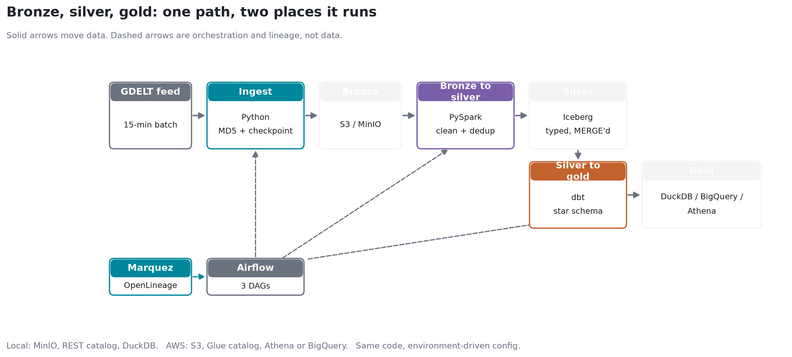

# GDELT Global Events Lakehouse

[](https://github.com/abhirammv2000/gdelt-lakehouse/actions/workflows/ci.yml)

A lakehouse for the GDELT 2.0 global events feed. GDELT publishes a new batch of world-news events every 15 minutes as tab-delimited files with no header, 61 columns, and the usual mess (nulls, encoding quirks, the odd malformed row). This project ingests the feed, cleans it, and serves a tested star schema.

It runs locally on Docker, and the same code has been run end to end on real AWS and real Azure. Only configuration changes between them (endpoints, credentials, catalog type).

## How it works

A bronze, silver and gold layout:

- **Ingest (Python):** poll the feed, check the MD5, land the raw zips in bronze, and checkpoint so re-runs are safe.
- **Bronze to silver (PySpark):** parse the 61 columns, clean, dedupe, and MERGE into silver. Rows that don't match the 61-field contract go to a rejects table instead of being forced in. Iceberg on the Glue and REST catalogs, Delta on Unity Catalog.
- **Silver to gold (dbt):** a star schema (`fact_events` plus date, actor, geography and event-type dimensions) with 19 dbt tests, plus a source freshness check. The same models run on DuckDB, BigQuery, Athena and Databricks SQL.
- **Orchestration (Airflow):** a 15-minute incremental DAG, a backfill DAG and a weekly Iceberg maintenance DAG.



| Layer | Local | AWS | Azure |
|---|---|---|---|
| Storage | MinIO | S3 | ADLS Gen2 |
| Catalog | Iceberg REST | Glue | Unity Catalog |
| Processing | PySpark | PySpark | PySpark on Databricks |
| Warehouse | DuckDB | Athena | Databricks SQL |
| Infrastructure | Docker Compose | Terraform | Terraform |

## Results

From actual runs on a laptop and on both clouds. Details are in [docs/RESULTS.md](docs/RESULTS.md).

- **Local:** 9 batches (10,163 rows) through silver and gold in about 55 seconds. All 10,163 matched the 61-field contract, and all 9 silver quality checks and 19 dbt tests passed.
- **AWS:** ingest to S3, Spark writing Iceberg through Glue, dbt gold models built by Athena. `PASS=28 ERROR=0`.
- **Azure:** a full day of GDELT, 93 files and 106,909 events, through Databricks and Unity Catalog. A re-run changed nothing, so the MERGE is idempotent. `PASS=28 ERROR=0`.
- **Is Spark the right tool?** At this volume, no. On one day of data DuckDB took 1.39 s and PySpark 22.49 s, about 16x slower, with about 14 s of that being JVM start-up. I kept Spark because the job is meant for larger volumes. Method and caveats are in [docs/BENCHMARK.md](docs/BENCHMARK.md).

Airflow only ran locally. MWAA and Databricks Workflows were not tried, and on AWS Spark was a local process pointed at S3. Cloud resources were created with Terraform and torn down after each run.

## Quickstart

```bash
make install     # package and dev tooling
make up          # local stack: MinIO, Iceberg, Spark, Airflow, Marquez
make ingest      # latest 15-minute batch into bronze
make silver      # bronze to silver
make dbt-build   # gold star schema and dbt tests
make test
```

Backfill a date range with `make backfill FROM=2026-07-20 TO=2026-07-21`. The window is capped at 30 days (`GDELT_MAX_BACKFILL_DAYS`) so a mistyped range can't pull GDELT's whole archive.

To build the gold models on BigQuery or Databricks SQL, or to run the whole pipeline on Azure, see [docs/CLOUD.md](docs/CLOUD.md).

| Service | URL |
|---|---|
| Airflow | http://localhost:8081 (admin / admin) |
| MinIO console | http://localhost:9001 (minioadmin / minioadmin) |
| Spark UI | http://localhost:8082 |
| Marquez | http://localhost:3000 |

## Layout

```
src/gdelt_pipeline/   config, schema, ingestion CLI
spark/                bronze-to-silver job and its tests
dbt/                  gold star schema: models, seeds, snapshots, tests
airflow/dags/         incremental, backfill and maintenance DAGs
terraform/            aws/ and azure/ infrastructure
docker/               custom Airflow and Spark images
.github/workflows/    CI: ruff, mypy, pytest, terraform validate for both clouds
docs/                 results, benchmark, cloud instructions
```
