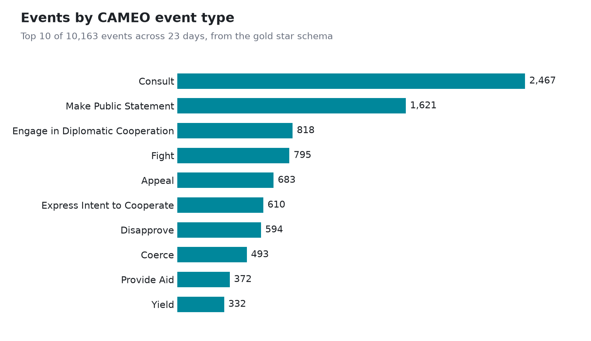

# Results

Numbers below are from actual runs. Reproduce the local ones with the Quickstart in the README.

**Volume and runtime** (laptop, Docker Desktop, single Spark container)

| Stage | Work | Wall time |
|---|---|---|
| Ingest one batch | 1 zip, 54 KB | 8.3 s |
| Bronze to silver | 9 batch files, 10,163 rows parsed, deduped, quality-gated, merged | 39.9 s |
| dbt build (gold) | 7 models, 1 snapshot, 1 seed, 19 tests | 15.4 s |

A single 15-minute GDELT batch held 614 to 2,743 events (median 888) across the nine
batches loaded. Spark time is dominated by JVM startup at this size; the job is built
for the shape of the work, not this volume (see [docs/BENCHMARK.md](docs/BENCHMARK.md)).

**Data quality**: 10,163 of 10,163 rows matched the 61-field contract (0 quarantined),
and all 9 silver expectations plus all 19 dbt tests passed (`PASS=28 ERROR=0`).

Row-level tests only see rows that actually landed, so they cannot catch the failure
that matters most on a schedule: nothing landing at all. `dbt source freshness` closes
that gap by checking the newest `date_added` in silver against how long ago it should
have been refreshed (warn past 20 minutes, error past 60, one and four missed 15-minute
batches):

```bash
dbt source freshness --project-dir dbt --profiles-dir dbt
# 1 of 1 PASS freshness of silver.events
```

**Gold star schema**: 10,163 facts, 546 actors, 1,134 geographies, 150 event types,
23 dates.



Three queries against the gold layer:

```sql
-- 1. Conflict vs cooperation mix
select c.quad_class_name, count(*) events,
       round(avg(f.goldstein_scale), 2) avg_goldstein
from fact_events f join dim_cameo_event c using (cameo_key)
group by 1 order by events desc;
```

| quad_class_name | events | % | avg_goldstein |
|---|---|---|---|
| Verbal Cooperation | 5,381 | 52.9 | 2.01 |
| Material Cooperation | 1,741 | 17.1 | 5.48 |
| Verbal Conflict | 1,609 | 15.8 | -3.39 |
| Material Conflict | 1,432 | 14.1 | -8.34 |

The Goldstein scale runs +5.48 for material cooperation down to -8.34 for material
conflict, which is what CAMEO defines it to do. That the dimension join reproduces it
is a useful check that the keys are right.

```sql
-- 2. Where events happen, and how negative the coverage is
select g.country_code, count(*) events, round(avg(f.avg_tone), 2) avg_tone
from fact_events f join dim_geography g using (geo_key)
group by 1 order by events desc limit 5;
```

| country_code | events | avg_tone |
|---|---|---|
| US | 4,413 | -2.24 |
| IN | 514 | -3.46 |
| IS | 380 | -3.46 |
| UK | 332 | -1.75 |
| NI | 324 | -0.82 |

```sql
-- 3. Most common event types (the chart above)
select c.root_description, count(*) events, round(avg(f.avg_tone), 2) avg_tone
from fact_events f join dim_cameo_event c using (cameo_key)
group by 1 order by events desc limit 3;
```

| root_description | events | avg_tone |
|---|---|---|
| Consult | 2,467 | -1.44 |
| Make Public Statement | 1,621 | -2.25 |
| Engage in Diplomatic Cooperation | 818 | 0.16 |

Regenerate the chart with `python scripts/plot_top_event_types.py`.

## The same pipeline on AWS

Run end to end against real AWS, with Terraform creating the buckets, the Glue
database, and a least-privilege IAM role first.

| Stage | Where it ran | Result |
|---|---|---|
| Ingest | S3 bronze bucket | 1 batch landed, 18 KB |
| Bronze to silver | Spark, Iceberg on the Glue catalog | 317 rows, 0 non-conformant, 9/9 quality checks |
| Gold | dbt via Athena on the same Glue tables | `PASS=28 WARN=0 ERROR=0` |

All five gold tables register in Glue as `table_type=ICEBERG` backed by S3, and the
quad-class query reproduces the same Goldstein polarity as the local run (+5.79 for
material cooperation, -7.85 for material conflict) on independently ingested data.

## The same pipeline on Azure

Run end to end against real Azure, with Terraform creating the ADLS Gen2 account,
the Databricks workspace, and the access connector Unity Catalog authenticates with.
This run used a full day of GDELT rather than a single batch.

| Stage | Where it ran | Result |
|---|---|---|
| Ingest | ADLS Gen2 bronze container | 93 files landed, re-run skipped all 93 |
| Bronze to silver | Spark on Databricks, Delta on Unity Catalog | 106,909 rows in 59 s, 9/9 quality checks |
| Gold | dbt via a Databricks SQL warehouse on the same table | `PASS=28 WARN=0 ERROR=0` in 34 s |

Silver is a Delta table in the project's own ADLS container, partitioned by
`sql_date`, holding exactly one row per `global_event_id` across all 93 source
files. Re-running the job left the count unchanged, so the recency-guarded MERGE is
idempotent on Delta exactly as it is on Iceberg.

Gold is the same five-table star schema: 106,909 facts, 1,879 actors, 6,517
geographies, 207 event types. The quad-class query again reproduces the Goldstein
polarity (+5.52 material cooperation, -7.94 material conflict), which is the check
that the dimension keys are right on a third independent load.

**What Azure needed that AWS did not.** Unity Catalog reaches external storage
through a Databricks *access connector*, a managed identity separate from the
workspace, and Azure RBAC keeps control-plane rights separate from data-plane
access, so `Storage Blob Data Contributor` has to be granted explicitly. Both are in
`terraform/azure/`. Blob versioning is also unavailable on a hierarchical-namespace
account, so the S3 versioning story has no Azure counterpart; see
[terraform/azure/README.md](../terraform/azure/README.md).

**Orchestration.** The `gdelt_incremental` DAG runs ingest, bronze to silver, and dbt
build in sequence, and Airflow is set up to send OpenLineage events to Marquez. I have not
captured a lineage graph for the README.

## Failure modes

Tests trigger these failures on purpose: a corrupt file that fails its MD5 while the rest of the batch
still lands, a partial batch that re-runs and fetches only what is missing, a
mixed batch of truncated and over-wide rows, a phantom 62nd column (and the
historical trailing tab that must *not* be mistaken for one), a replayed batch
that tries to move the checkpoint backwards.

```bash
pytest tests/test_failure_modes.py     # 6 passed
```

They run in CI. Some other failure modes I thought of while designing it have no test yet,
so I don't claim them.
